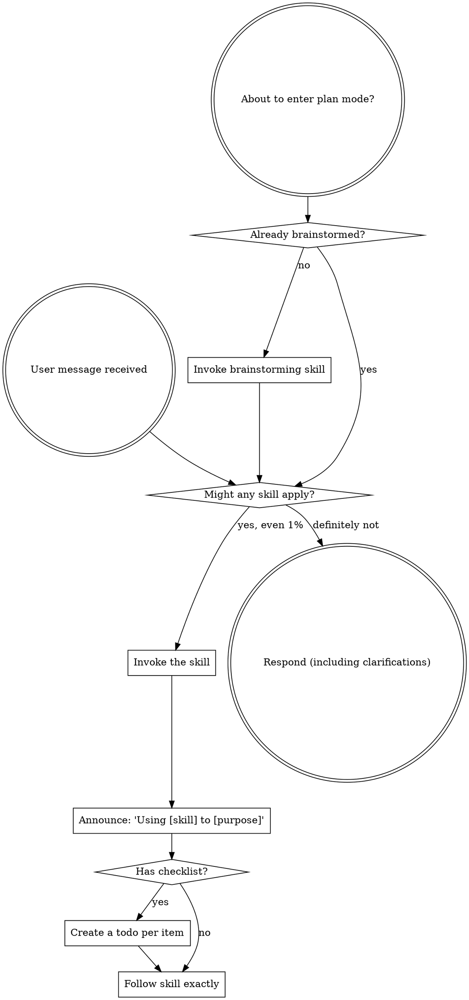

# codex advisor artifact

- Provider: codex
- Exit code: 0
- Created at: 2026-07-04T19:55:32.078Z

## Original task

You are one reviewer on a model council reviewing a product spec for GO/PIVOT/KILL. Read /Users/damianborek/Downloads/structly_spec_v4.md (Structly v4: iOS-first capture->verified-spreadsheet app for UK sole traders). It is the corrected spec after a council review of v2/v3; the prior findings are in /Users/damianborek/Downloads/model-council-synthesis.md and /Users/damianborek/Downloads/model-council-claude_opus_4_8.md. Your lens: architecture, feasibility, compliance, unit economics. Assess adversarially: (1) does v4 genuinely fix EACH prior council finding (Gmail compose/restricted-scope inversion, 'Composio manages consent' myth, impossible 14-day launch, lifetime-tier COGS mismatch, margin-negative Power tier, episodic retention) or does it introduce new regressions; (2) is the 3-week solo-dev TestFlight plan realistic given OCR/extraction accuracy work, xlsx template engine, RevenueCat, and the golden-test-pack gate; (3) unit economics: Free 5 captures / Pro GBP6.99 for 100 captures with vision-LLM extraction COGS per multi-receipt job - check the math; (4) remaining compliance/security gaps: GDPR/UK data residency, App Store review requirements (privacy labels, account deletion, AI-provider disclosure), extraction-error liability for VAT-ready claims, prompt-injection posture; (5) verdict GO/PIVOT/KILL plus THE single most important change. Reference spec section numbers. Be specific, sceptical, and concrete - no praise padding.

## Final prompt

You are one reviewer on a model council reviewing a product spec for GO/PIVOT/KILL. Read /Users/damianborek/Downloads/structly_spec_v4.md (Structly v4: iOS-first capture->verified-spreadsheet app for UK sole traders). It is the corrected spec after a council review of v2/v3; the prior findings are in /Users/damianborek/Downloads/model-council-synthesis.md and /Users/damianborek/Downloads/model-council-claude_opus_4_8.md. Your lens: architecture, feasibility, compliance, unit economics. Assess adversarially: (1) does v4 genuinely fix EACH prior council finding (Gmail compose/restricted-scope inversion, 'Composio manages consent' myth, impossible 14-day launch, lifetime-tier COGS mismatch, margin-negative Power tier, episodic retention) or does it introduce new regressions; (2) is the 3-week solo-dev TestFlight plan realistic given OCR/extraction accuracy work, xlsx template engine, RevenueCat, and the golden-test-pack gate; (3) unit economics: Free 5 captures / Pro GBP6.99 for 100 captures with vision-LLM extraction COGS per multi-receipt job - check the math; (4) remaining compliance/security gaps: GDPR/UK data residency, App Store review requirements (privacy labels, account deletion, AI-provider disclosure), extraction-error liability for VAT-ready claims, prompt-injection posture; (5) verdict GO/PIVOT/KILL plus THE single most important change. Reference spec section numbers. Be specific, sceptical, and concrete - no praise padding.

## Raw output

```text
**Verdict: PIVOT**

v4 fixes the headline v2/v3 factual errors, but it is not yet a clean GO. The new failure point is that the spec asserts “cheap, capped, trustworthy extraction” without defining cap semantics, accuracy thresholds, liability posture, or the actual compliance controls needed for financial/user-content processing.

**Prior Findings**

| Prior finding | v4 status |
|---|---|
| Gmail `compose` / restricted-scope inversion | Mostly fixed. MVP removes OAuth entirely in §4/§7, and Phase 2 says `gmail.send`, not drafts, in §9/§15. Caveat: §15 “Drive/Sheets” must explicitly be `drive.file`/user-export only, or it can reintroduce review scope creep. |
| “Composio manages consent” myth | Fixed for MVP. §0/§4/§6 remove Composio; §9 says Structly owns OAuth verification later. But §15 still leaves Composio as a Phase 3 option without a DPA/subprocessor/residency decision. |
| Impossible 14-day launch | Partly fixed. §11 drops public launch and Android first. But the replacement “3-week TestFlight MVP” is still optimistic for a trust-sensitive finance workflow. |
| Lifetime-tier COGS mismatch | Fixed. §10 removes lifetime pricing. |
| Margin-negative Power tier | Fixed on paper. §10 removes 500-capture Power. New regression: “capture” is ambiguous. If Pro means 100 multi-receipt jobs at 30 receipts/job, it is not the same product as 100 receipt captures. |
| Episodic retention | Not fully fixed. §2/§5/§13 add monthly VAT packs, reminders, category memory, and a two-cycle retention gate. That is better, but UK sole traders often batch monthly/quarterly; this still may be too low-frequency for a £6.99 monthly habit. |

**3-Week TestFlight Reality**

Not realistic as specified. A demo is plausible; a credible paid beta is not.

The overloaded week is §11. By Day 13, the plan expects capture, auth, EU storage, vision extraction, inline correction, xlsx/csv generation, validation sheets, duplicate detection, VAT math, RevenueCat, quota metering, and then a 30–50 sample golden pack. That reverses the quality process: the golden pack needs to exist before extraction work, with acceptance thresholds, fixture images, expected JSON, expected xlsx outputs, and failure tolerances.

The xlsx engine is also understated. §5 promises data, validation, summary, source-image traceability, confidence flags, duplicate detection, VAT reconciliation, inline corrections, and export/share. That is not just `exceljs`; it is a mini accounting artifact pipeline plus mobile file UX. Day 7–9 is too compressed.

**Unit Economics**

The math is safe only under a narrow interpretation.

At £6.99/mo, after a 15% app-store commission you have about £5.94/month before infra, support, failed jobs, refunds, RevenueCat, storage, analytics, and tax/accounting overhead. At 100 receipt captures, that is about £0.059 gross contribution budget per receipt. Fine.

If “100 captures” means 100 jobs and each Pro job can contain 30 receipts (§10), the cap is actually 3,000 receipts/month, or about £0.002 per receipt before all other costs. That is the dangerous interpretation.

Current model pricing makes the difference material: Gemini 2.5 Flash is priced at $0.30/M input and $2.50/M output tokens, and Flash-Lite at $0.10/M input and $0.40/M output tokens; OpenAI’s current cheaper frontier-mini tier shown in pricing is materially higher at $0.75/M input and $4.50/M output for `gpt-5.4-mini` standard short context. A one-pass cheap model may be fine. A higher-accuracy model, retries, reprocessing, image normalization, and support can erase annual-plan margin quickly, especially since §10 offers £49/year, which is only ~£3.47/month net after 15% commission.

Single required fix here: price and meter by **receipt/page**, not “capture,” and make multi-receipt jobs debit quota per receipt with a lower monthly cap until real COGS are measured.

**Compliance / Security Gaps**

§9 is too thin.

Apple requires privacy policy disclosure of collected data, third-party sharing, retention/deletion, and user deletion mechanisms; account-creating apps must offer in-app account deletion. Apple’s privacy labels also require declaring data collected by third-party partners, including photos/videos, financial info, user content, diagnostics, analytics, and linked identity where applicable. Sources: Apple App Review 5.1.1 and App Privacy Details. ([developer.apple.com](https://developer.apple.com/app-store/review/guidelines/)) ([developer.apple.com](https://developer.apple.com/app-store/app-privacy-details/))

EU hosting is not the same as GDPR compliance. §9 needs a named lawful basis, processor/subprocessor list, DPA coverage for Supabase/PostHog/AI provider/storage/RevenueCat, retention schedule, DSAR workflow, breach process, and cross-border transfer basis if any AI provider processes outside the UK/EU.

App Store AI disclosure is under-specified. Apple does not have the exact same “AI provider consent screen” framing as Google Play, but it does require accurate privacy disclosures, consent for data collection, clear purpose strings, and third-party data protection. For Android fast-follow, Google’s AI-generated content policy places responsibility for generated content on the developer; the spec should not assume extraction outputs are exempt from review scrutiny just because they are productivity artifacts. ([support.google.com](https://support.google.com/googleplay/android-developer/answer/14094294?hl=en))

Liability is the biggest omission. §5/§16 say “VAT-ready” and “you can trust.” That is dangerous. The product is not regulated accounting software, but it is handling financial records. It needs explicit “review required,” no tax/accounting advice, confidence-gated exports, audit trail, correction log, and possibly “draft for bookkeeping, not filing advice” language.

Prompt injection posture is improved but incomplete. §8 correctly removes external write actions/code execution. Still missing: schema-level refusal for OCR text that tries to override instructions, field provenance per receipt, model-output validation independent of model confidence, adversarial fixtures in the golden pack, and never putting untrusted OCR text into formulas/hyperlinks without escaping.

**Single Most Important Change**

Change the product contract from “100 captures/month, VAT-ready verified spreadsheet” to:

**“100 receipt pages/month; every page consumes quota; export is review-required bookkeeping prep, not tax advice; release only when the golden pack meets explicit per-field accuracy thresholds.”**

That one change fixes the cap ambiguity, protects margin, reduces liability, and forces the build plan to prove the actual trust claim before selling it.

Final call: **PIVOT**, not KILL. The no-OAuth, deterministic-spreadsheet direction is the right subtraction. But do not GO until §10 metering, §11 quality gates, and §9 compliance/liability are rewritten concretely.


OpenAI Codex v0.142.2
--------
workdir: /Users/damianborek
model: gpt-5.5
provider: openai
approval: never
sandbox: danger-full-access
reasoning effort: medium
reasoning summaries: none
session id: 019f2eb1-9ed1-7e40-8cd4-0d6646b57271
--------
user
You are one reviewer on a model council reviewing a product spec for GO/PIVOT/KILL. Read /Users/damianborek/Downloads/structly_spec_v4.md (Structly v4: iOS-first capture->verified-spreadsheet app for UK sole traders). It is the corrected spec after a council review of v2/v3; the prior findings are in /Users/damianborek/Downloads/model-council-synthesis.md and /Users/damianborek/Downloads/model-council-claude_opus_4_8.md. Your lens: architecture, feasibility, compliance, unit economics. Assess adversarially: (1) does v4 genuinely fix EACH prior council finding (Gmail compose/restricted-scope inversion, 'Composio manages consent' myth, impossible 14-day launch, lifetime-tier COGS mismatch, margin-negative Power tier, episodic retention) or does it introduce new regressions; (2) is the 3-week solo-dev TestFlight plan realistic given OCR/extraction accuracy work, xlsx template engine, RevenueCat, and the golden-test-pack gate; (3) unit economics: Free 5 captures / Pro GBP6.99 for 100 captures with vision-LLM extraction COGS per multi-receipt job - check the math; (4) remaining compliance/security gaps: GDPR/UK data residency, App Store review requirements (privacy labels, account deletion, AI-provider disclosure), extraction-error liability for VAT-ready claims, prompt-injection posture; (5) verdict GO/PIVOT/KILL plus THE single most important change. Reference spec section numbers. Be specific, sceptical, and concrete - no praise padding.
warning: failed to parse plugin hooks config /Users/damianborek/.codex/plugins/cache/openai-codex/codex/1.0.5/hooks/hooks.json: unknown field `description`, expected `hooks` at line 2 column 15
warning: failed to parse plugin hooks config /Users/damianborek/.codex/plugins/cache/claude-plugins-official/ralph-loop/1.0.0/hooks/hooks.json: unknown field `description`, expected `hooks` at line 2 column 15
warning: failed to parse plugin hooks config /Users/damianborek/.codex/plugins/cache/claude-plugins-official/security-guidance/2.0.6/hooks/hooks.json: unknown field `description`, expected `hooks` at line 2 column 15
hook: SessionStart
hook: SessionStart
hook: SessionStart Completed
hook: SessionStart Completed
hook: UserPromptSubmit
hook: UserPromptSubmit Completed
codex
I’ll assess v4 against the prior council findings and current compliance constraints, then give a GO/PIVOT/KILL verdict with section-grounded evidence. I’m reading the three local files first, then I’ll verify current external requirements where the spec depends on App Store or legal/platform rules.
hook: PreToolUse
hook: PreToolUse
hook: PreToolUse Completed
hook: PreToolUse Completed
exec
/bin/zsh -lc "sed -n '1,240p' /Users/damianborek/.codex/plugins/cache/claude-plugins-official/superpowers/6.0.3/skills/using-superpowers/SKILL.md" in /Users/damianborek
 succeeded in 0ms:
---
name: using-superpowers
description: Use when starting any conversation - establishes how to find and use skills, requiring skill invocation before ANY response including clarifying questions
---

<SUBAGENT-STOP>
If you were dispatched as a subagent to execute a specific task, skip this skill.
</SUBAGENT-STOP>

<EXTREMELY-IMPORTANT>
If you think there is even a 1% chance a skill might apply to what you are doing, you ABSOLUTELY MUST invoke the skill.

IF A SKILL APPLIES TO YOUR TASK, YOU DO NOT HAVE A CHOICE. YOU MUST USE IT.

This is not negotiable. This is not optional. You cannot rationalize your way out of this.
</EXTREMELY-IMPORTANT>

## Instruction Priority

Superpowers skills override default system prompt behavior, but **user instructions always take precedence**:

1. **User's explicit instructions** (CLAUDE.md, GEMINI.md, AGENTS.md, direct requests) — highest priority
2. **Superpowers skills** — override default system behavior where they conflict
3. **Default system prompt** — lowest priority

If CLAUDE.md, GEMINI.md, or AGENTS.md says "don't use TDD" and a skill says "always use TDD," follow the user's instructions. The user is in control.

## How to Access Skills

**Never read skill files manually with file tools** — always use your platform's skill-loading mechanism so the skill is properly activated.

**In Claude Code:** Use the `Skill` tool. When you invoke a skill, its content is loaded and presented to you — follow it directly.

**In Codex:** Skills load natively. Follow the instructions presented when a skill activates.

**In Copilot CLI:** Use the `skill` tool. Skills are auto-discovered from installed plugins.

**In Gemini CLI:** Skills activate via the `activate_skill` tool. Gemini loads skill metadata at session start and activates the full content on demand.

**In other environments:** Check your platform's documentation for how skills are loaded.

## Platform Adaptation

Skills speak in actions ("dispatch a subagent", "create a todo", "read a file") rather than naming any one runtime's tools. For per-platform tool equivalents and instructions-file conventions, see [claude-code-tools.md](references/claude-code-tools.md), [codex-tools.md](references/codex-tools.md), [copilot-tools.md](references/copilot-tools.md), [gemini-tools.md](references/gemini-tools.md), [pi-tools.md](references/pi-tools.md), and [antigravity-tools.md](references/antigravity-tools.md). Gemini CLI users get the tool mapping loaded automatically via GEMINI.md.

# Using Skills

## The Rule

**Invoke relevant or requested skills BEFORE any response or action.** Even a 1% chance a skill might apply means that you should invoke the skill to check. If an invoked skill turns out to be wrong for the situation, you don't need to use it.



## Red Flags

These thoughts mean STOP—you're rationalizing:

| Thought | Reality |
|---------|---------|
| "This is just a simple question" | Questions are tasks. Check for skills. |
| "I need more context first" | Skill check comes BEFORE clarifying questions. |
| "Let me explore the codebase first" | Skills tell you HOW to explore. Check first. |
| "I can check git/files quickly" | Files lack conversation context. Check for skills. |
| "Let me gather information first" | Skills tell you HOW to gather information. |
| "This doesn't need a formal skill" | If a skill exists, use it. |
| "I remember this skill" | Skills evolve. Read current version. |
| "This doesn't count as a task" | Action = task. Check for skills. |
| "The skill is overkill" | Simple things become complex. Use it. |
| "I'll just do this one thing first" | Check BEFORE doing anything. |
| "This feels productive" | Undisciplined action wastes time. Skills prevent this. |
| "I know what that means" | Knowing the concept ≠ using the skill. Invoke it. |

## Skill Priority

When multiple skills could apply, use this order:

1. **Process skills first** (brainstorming, systematic-debugging) - these determine HOW to approach the task
2. **Implementation skills second** (frontend-design, mcp-builder) - these guide execution

"Let's build X" → brainstorming first, then implementation skills.
"Fix this bug" → systematic-debugging first, then domain-specific skills.

## Skill Types

**Rigid** (TDD, systematic-debugging): Follow exactly. Don't adapt away discipline.

**Flexible** (patterns): Adapt principles to context.

The skill itself tells you which.

## User Instructions

Instructions say WHAT, not HOW. "Add X" or "Fix Y" doesn't mean skip workflows.

hook: PostToolUse
hook: PostToolUse
exec
/bin/zsh -lc 'wc -l /Users/damianborek/Downloads/structly_spec_v4.md /Users/damianborek/Downloads/model-council-synthesis.md /Users/damianborek/Downloads/model-council-claude_opus_4_8.md' in /Users/damianborek
 succeeded in 0ms:
     258 /Users/damianborek/Downloads/structly_spec_v4.md
      54 /Users/damianborek/Downloads/model-council-synthesis.md
     198 /Users/damianborek/Downloads/model-council-claude_opus_4_8.md
     510 total

hook: PostToolUse
hook: PostToolUse
hook: PostToolUse Completed
hook: PostToolUse Completed
hook: PostToolUse Completed
hook: PostToolUse Completed
codex
Using `superpowers:using-superpowers` for the required skill check, and `analyze` for a read-only, evidence-grounded spec assessment. No code edits are in scope; stop condition is a section-cited verdict with compliance/unit-economics checks.
hook: PreToolUse
hook: PreToolUse
hook: PreToolUse
hook: PreToolUse
hook: PreToolUse Completed
hook: PreToolUse Completed
hook: PreToolUse Completed
hook: PreToolUse Completed
exec
/bin/zsh -lc "nl -ba /Users/damianborek/Downloads/structly_spec_v4.md | sed -n '1,320p'" in /Users/damianborek
exec
/bin/zsh -lc "nl -ba /Users/damianborek/Downloads/model-council-synthesis.md | sed -n '1,120p'" in /Users/damianborek
 succeeded in 0ms:
     1	# Model Council Review — CueMate / LensAgent Spec (v2)
     2	
     3	Consulted: **Claude Opus 4.8**, **GPT 5.5**, and **Gemini 3.1 Pro**, each independently reviewing the locked spec and grounding claims with live web sources.
     4	
     5	## Where Models Agree
     6	
     7	| Finding | Claude Opus 4.8 | GPT 5.5 | Gemini 3.1 Pro | Evidence |
     8	|---------|:---:|:---:|:---:|----------|
     9	| The overall verdict is **PIVOT, not go-as-written and not kill** | ✓ | ✓ | ✓ | All three reject the consumer horizontal MVP but keep the core architecture ([Composio pricing](https://composio.dev/pricing)) |
    10	| The consumer "camera → action" wedge is **already occupied** by ChatGPT, Gemini, and Google's Magic Cue | ✓ | ✓ | ✓ | [OpenAI ChatGPT connectors](https://help.openai.com/en/articles/11487775-connectors-in-chatgpt), [Gemini Apps Help](https://support.google.com/gemini/answer/13695044?hl=en), [Android Authority Magic Cue](https://www.androidauthority.com/google-pixel-10-magic-cue-third-party-apps-preview-3675330/) |
    11	| **"Action-first, not chat-first" is positioning, not a moat** | ✓ | ✓ | ✓ | ChatGPT/Gemini already do camera + connectors + confirm-before-send |
    12	| The **Gmail scope tiers are misunderstood**: `gmail.compose`/drafts is *restricted* (triggers CASA), while `gmail.send` is only *sensitive* | ✓ | ✓ | ✓ | [Gmail API scopes, Google](https://developers.google.com/workspace/gmail/api/auth/scopes) |
    13	| **Composio does NOT absorb Google verification/CASA** — you still own it once you bring your own branded OAuth app | ✓ | ✓ | ✓ | [Composio custom auth](https://docs.composio.dev/docs/auth-configuration/custom-auth-configs), [Managed vs custom](https://docs.composio.dev/docs/custom-app-vs-managed-app) |
    14	| **EU data residency only exists at Composio's Enterprise/VPC tier** — undercutting the RegTech endgame at solo pricing | ✓ | ✓ | ✓ | [Composio Enterprise](https://composio.dev/enterprise), [Unified.to comparison](https://unified.to/blog/composio_vs_unified_which_mcp_platform_is_right_for_your_ai_product_in_2026) |
    15	| Composio had a **May 2026 security incident** — a real liability for a "privacy as a feature" app holding user tokens | ✓ | ✓ | | [Composio May 2026 incident](https://composio.dev/blog/composio-may-2026-security-incident) |
    16	| The **2-week public launch + payments milestone is not achievable**; realistic is ~6–12 weeks | ✓ | ✓ | ✓ | [Google OAuth FAQ (6-week restricted review)](https://support.google.com/cloud/answer/13463817), [RevenueCat Play 14-day gate](https://www.revenuecat.com/blog/engineering/google-play-14-day/) |
    17	| **Retention is the core weakness** — episodic scanning ("tidy once, churn") — the one durable retention story is habitual B2B use | ✓ | ✓ | ✓ | Spec's own Finding 2; all three flag the same failure mode |
    18	| The **£79 lifetime tier / usage-based COGS mismatch** and the ambitious **30%-connect + 3–5% free-to-paid** funnel are optimistic | ✓ | ✓ | ✓ | [RevenueCat State of Subscription Apps 2026](https://www.revenuecat.com/state-of-subscription-apps/) |
    19	
    20	## Where Models Disagree
    21	
    22	| Topic | Claude Opus 4.8 | GPT 5.5 | Gemini 3.1 Pro | Why They Differ |
    23	|-------|-----------------|---------|----------------|-----------------|
    24	| **The Jan 28 2026 Android Play date** | Confirmed correct, cited Google's deadline table | Could **not** verify the specific date on the official policy page — flagged Medium risk | Confirmed correct via third-party coverage | Different source reliance: Opus found Google's deadlines table, GPT distrusted secondary sources, Gemini relied on press/blog coverage |
    25	| **The "Android 17 AAPM" claim** | Overstated but real (only fires when user enables Advanced Protection) | Likely **wrong** — official page says Android **16**, not 17 | Not separately challenged | GPT read the OS-version claim more literally; Opus focused on the enablement condition |
    26	| **Which pivot to make** | iOS-first + B2B-vertical-first, but keep it deliberate; abstract Composio behind own interface | **Pivot-to-wedge first** — one narrow consumer workflow (appointment/letter → calendar/draft) before any B2B, scope-minimized | **Jump straight to B2B (Phase 4)** — abandon consumer entirely now | Different risk appetite: GPT wants to prove a loop cheaply first; Gemini says the consumer market is already lost; Opus lands in between |
    27	| **How to handle the email action in v1** | Use `gmail.send` (sensitive, no CASA) + `drive.file`; skip drafts | **Avoid the Gmail API entirely** — use `mailto:`/native share sheet/local draft to dodge all scopes | Warns even a doc→email flow may trigger verification; less prescriptive on the exact scope fix | GPT is most conservative (avoid the API); Opus offers a concrete scope-swap; Gemini stays cautionary |
    28	| **CASA cost framing** | ~$540–$1,800/yr (debunks $15K–75K folklore) | Cost negotiated with assessor; no direct Google charge; weeks-to-months | $540–$2,000, 4–6 weeks | Agreement on the low number; slightly different emphasis on who charges and timeline |
    29	| **"Store-safe" claim** | True for the accessibility/scraping risk — architecture is correct | **Too strong** — store approval still needs privacy disclosures, account deletion, AI-provider consent, least-privilege | Agrees front-door API is store-safe, less caveated | GPT weighted the residual store-review surface (privacy labels, 5.1.1) more heavily |
    30	
    31	## Unique Discoveries
    32	
    33	| Model | Unique Finding | Why It Matters |
    34	|-------|----------------|----------------|
    35	| Claude Opus 4.8 | Google Play's **Nov-2025 in-app AI-provider consent-screen requirement** (policy 5.1.1) — your camera→cloud-vision flow triggers it ([Fora Soft](https://www.forasoft.com/blog/article/how-to-get-you-app-approved-on-google-play-and-the-app-store)) | An unbudgeted (if small) launch requirement the spec's 14-day plan omits |
    36	| Claude Opus 4.8 | The **Android 12-tester / 14-day closed-test gate** for personal Play accounts created after 13 Nov 2023 makes a Day-14 Android public launch *physically impossible*; internal testing doesn't count ([Google Play testing rules](https://support.google.com/googleplay/android-developer/answer/14151465)) | Hard, non-negotiable blocker on the headline milestone — strongest single argument for iOS-first |
    37	| Claude Opus 4.8 | **Apple's agentic Siri AI being EU-banned is a mild tailwind** for an EU builder — Apple's own visual-action assistant won't exist on EU iPhones ([Apple Newsroom](https://www.apple.com/newsroom/2026/06/due-to-dma-siri-ai-delayed-in-eu-for-ios-27-and-ipados-27/)) | Reframes a "threat" as a narrow, time-boxed positioning window |
    38	| GPT 5.5 | Composio's **default OAuth app shares quota across all users and has limited approved scopes** — the "5-minute" demo path is not the production path ([Composio custom auth](https://docs.composio.dev/docs/auth-configuration/custom-auth-configs)) | Explains exactly why "Composio manages consent" collapses at production |
    39	| GPT 5.5 | **RevenueCat 2026 benchmarks**: freemium median D35 conversion is 2.1% (top quartile 4.5%); App Store 2.6% vs Google Play 0.9% | The spec's 3–5% target sits at/above top quartile, and Android installs barely convert — quantifies the funnel optimism |
    40	| GPT 5.5 | Reframe pricing around **workflow value ("20 completed admin tasks/month")** not vendor-cost "scans" | Aligns the paywall with user-perceived value and protects margin against usage COGS |
    41	| Gemini 3.1 Pro | **Established "Scan-to-Salesforce" apps already exist** on the App Store / AppExchange ([Seamlessly for Salesforce](https://apps.apple.com/us/app/seamlessly-for-salesforce/id6756211051)) | The B2B pivot everyone recommends is itself not greenfield — competitive due diligence needed before committing |
    42	| Gemini 3.1 Pro | **Gemini Live went free for all Android + iOS in May 2025** with real-time camera and Workspace actions ([9to5Google](https://9to5google.com/2025/05/30/gemini-live-camera-screen-wide/)) | A free, first-party product does the consumer use case today — hardest evidence that consumer WTP is thin |
    43	
    44	## Comprehensive Analysis
    45	
    46	The three models converged with unusual force on the headline call: **pivot the product, keep the architecture.** None recommended killing it, and none endorsed shipping the spec as written. When three frontier models independently reach the same verdict from different research paths, that is the highest-confidence signal in this review — treat "pivot" as settled, and spend your energy on *which* pivot.
    47	
    48	The strongest agreement, and the most actionable, is the **Gmail scope inversion**. All three independently found that the spec has it backwards: creating drafts requires `gmail.compose`, which Google classifies as a *restricted* scope that triggers the annual CASA security assessment, while merely *sending* via `gmail.send` is only *sensitive* and does not. Your "safe, review-free" free tier (draft-only) is in fact the tier that forces the audit. This is a factual correction, not a judgment call — fix it regardless of which direction you pivot. Claude Opus 4.8 and GPT 5.5 also both dismantled the "Composio manages consent" assumption with primary Composio docs: managed auth shares quota and shows "Composio wants to access your account" on the consent screen, so any real product must bring its own branded Google OAuth app — at which point *you* own verification and CASA, not Composio. The convergence here means the spec's entire compliance-cost model needs rebuilding before day one.
    49	
    50	The models also agree the competitive picture is worse than the spec admits, and their combined evidence is damning. Gemini 3.1 Pro — leaning on its Google-ecosystem knowledge — supplied the sharpest data point: Gemini Live has been *free* on both Android and iOS since May 2025, with live camera and Workspace actions, and Magic Cue is an OS-level version of the same promise now expanding to third-party apps. GPT 5.5 and Claude Opus 4.8 added that ChatGPT already drafts *and sends* Gmail with confirm-before-send. So "action-first, not chat-first" is a UI line, not a moat, and the consumer buyer already has three free or bundled ways to do this. Where they differ is instructive: Gemini says the consumer market is simply lost and you should jump straight to B2B; GPT 5.5 counsels a cheaper intermediate step — prove one narrow high-frequency workflow loop first (appointment/letter → calendar event or local email draft) using *no* restricted scopes and minimal Composio, then expand; Claude Opus 4.8 lands between them, recommending iOS-first + B2B-vertical-first but with Composio deliberately abstracted behind your own swappable interface. This is a genuine strategic fork worth your judgment: GPT's path de-risks by validating retention before spending on B2B connectors and CASA; Gemini's path skips a market it considers already dead; Opus's path hedges. Notably, Gemini also found that "Scan-to-Salesforce" apps *already ship* — so even the recommended B2B destination needs competitive diligence rather than being assumed greenfield.
    51	
    52	On timeline, the models agree the 14-day "launch + first payments" milestone is fiction, but Claude Opus 4.8 contributed the single most decisive fact: personal Google Play accounts created after November 2023 must run a closed test with 12 testers for 14 continuous days *before* they can even apply for production — making a Day-14 Android public launch physically impossible and internal testing insufficient. Combined with GPT 5.5's per-workstream slippage math (vision extraction, Composio auth debugging, and Salesforce object-mapping each 2–10 days), the honest estimate is a solo-dev iOS TestFlight closed beta with one connector in ~2–3 weeks, and a public, verified, multi-connector launch in 6–12 weeks. The lone disagreements — whether the "Jan 28 2026" date and "Android 17 AAPM" claims are precisely right — are minor: GPT couldn't verify the exact date on Google's official page and read the AAPM claim as citing Android 16 rather than 17, while Opus confirmed both with different sources. These don't change any conclusion; they're worth a quick fact-check for the spec's credibility but nothing rests on them.
    53	
    54	**Recommendation.** Adopt the PIVOT the council unanimously endorses, sequenced to satisfy all three models at once: (1) **immediately fix the scope model** — drop `gmail.compose`, use `gmail.send` + `drive.file`, or GPT's even-safer no-Gmail-API path via native share sheet, so v1 touches no restricted scopes and needs no CASA; (2) **go iOS-first** to sidestep the Android closed-test gate and exploit the EU Siri-AI ban window Opus identified; (3) **start with GPT's narrow wedge** — one high-frequency workflow to prove a retention loop cheaply — then move toward the B2B "scan → Salesforce/QuickBooks" vertical that Opus and Gemini both call the only durable moat, but only after checking the incumbents Gemini surfaced; (4) **wrap Composio behind your own action interface** so its documented incidents, shared-quota limits, and enterprise-only EU residency don't become single points of product, security, and compliance failure; and (5) **reprice around completed workflows, not scans, and cut the lifetime tier.** The core insight the whole council shares: your platform-legal homework was above average, but you aimed a store-safe architecture at a market three well-funded incumbents already own — redirect it at the business-tool write-back long tail they ignore, and fix the compliance facts before writing code.

 succeeded in 0ms:
     1	# Structly — Corrected Product Spec & Build Plan (v4)
     2	
     3	**Working name:** Structly
     4	**Owner:** Damian B
     5	**Date:** 04 July 2026
     6	**Status:** Corrected after Model Council review (Claude Opus 4.8, GPT 5.5, Gemini 3.1 Pro)
     7	**Platforms:** iOS-first (TestFlight → App Store), Android as a fast-follow
     8	**Core principle of this revision:** radical subtraction — ship the one narrow, recurring, trust-sensitive workflow you can own, with the OAuth facts corrected *before* building.
     9	
    10	---
    11	
    12	## 0. What Changed From v3 (and Why)
    13	
    14	The council reviewed v3 and hardened its verdict from v2's "pivot" to two PIVOTs and one KILL, judging v3 "a better demo but a worse MVP." v4 acts on their findings rather than re-litigating them. The corrections:
    15	
    16	| v3 mistake | v4 correction | Source of finding |
    17	|---|---|---|
    18	| Free tier = Gmail **drafts** (`gmail.compose` is a **Restricted** scope → triggers CASA) | **No Google OAuth at all in the MVP.** When email ships (Phase 2), use `gmail.send` (**Sensitive**, no CASA), never drafts | [Google Gmail API scopes](https://developers.google.com/workspace/gmail/api/auth/scopes) |
    19	| "Composio manages consent" | Removed. Composio accelerates the OAuth *flow* but **does not absorb Google verification or CASA** — the app owner does. Composio is out of the MVP entirely | [Composio auth docs](https://docs.composio.dev/docs/authentication) |
    20	| 14-day public launch | **Realistic timeline: ~3-week iOS TestFlight MVP; 6–10 weeks to a verified public launch** once any OAuth scope is added. Android public launch gated by a mandatory 12-tester / 14-day closed test | [Play testing rules](https://support.google.com/googleplay/android-developer/answer/14151465), [Google OAuth FAQ](https://support.google.com/cloud/answer/13463817) |
    21	| Daytona as the Phase-1 "paid hook" | **Daytona demoted to Phase 2.** Launch outputs use deterministic, backend-owned templates — cheaper, faster, more reliable, and no closed-source/EU dependency | Council COGS models; [Daytona closed-source June 2026](https://www.agenticwire.news/article/e2b-vs-daytona) |
    22	| Power tier £17.99 / 500 captures with open analysis | **Removed the margin-negative tier.** Pricing anchored to the £2–£10/mo market with hard usage caps | [SnapTrac](https://apps.apple.com/gb/app/snaptrac-receipt-scanner/id6767394756), [ReceiptsAI](https://receiptsai.com/tools/receipt-scanner) |
    23	| "RegTech-grade" prompt-injection threat model | Dropped the claim. Ships a **minimum-viable security posture** appropriate to a solo MVP; RegTech claims deferred until an actual assessment exists | Council security review |
    24	| "Capture → any output" (8 output types) | **One workflow:** multi-receipt/table capture → verified spreadsheet. Breadth is a Phase-2+ decision, not a launch bet | Council retention/focus finding |
    25	
    26	---
    27	
    28	## 1. One-Line Definition
    29	
    30	"Snap a stack of receipts or a table, and Structly gives you back a clean, verified spreadsheet — with every total checked and every source row traceable — ready to share or export."
    31	
    32	Not a chatbot, not a super-agent, not a connector platform. A single, reliable **capture → verified spreadsheet** utility for admin-heavy professionals.
    33	
    34	---
    35	
    36	## 2. The Corrected Strategic Thesis
    37	
    38	The council's through-line across v2 and v3: both prior specs aimed rented, undifferentiated infrastructure (Composio + Daytona) at a workflow free incumbents (ChatGPT Advanced Data Analysis, Gemini in Sheets) and purpose-built SaaS (Expensify, Dext) already own — while carrying a launch-blocking compliance error.
    39	
    40	v4's defensibility is **not** infrastructure. It is:
    41	
    42	1. **Trust and accuracy on financial artifacts** — a visible validation sheet, traceable source rows, confidence flags, and totals reconciliation. This is precisely where a general chatbot is weakest (it hands you a number with no audit trail) and where SnapTrac's "no AI / deterministic parsing" positioning already proves users value trust over cleverness.
    43	2. **Batching + repeat-workflow memory** — the incumbents make you re-prompt each time; Structly remembers your categories, VAT rules, and export format and anchors to a recurring trigger ("monthly VAT-ready pack," "Friday expense close").
    44	3. **A recurring, calendar-anchored habit** — the retention hook v2/v3 lacked.
    45	
    46	The bet: win the narrow "trustworthy monthly receipt pack" job first, prove retention and willingness-to-pay, *then* add connectors and a B2B path.
    47	
    48	---
    49	
    50	## 3. Target User (narrowed)
    51	
    52	**Launch persona:** UK sole traders, freelancers, and micro-business owners who compile receipts/expenses on a recurring cadence (monthly VAT prep, quarterly self-assessment, client reimbursement) and currently do it in a manual spreadsheet or a tool they find overkill.
    53	
    54	Deferred (Phase 3–4): bookkeepers and finance-ops teams who need connector push (QuickBooks/Xero) and audit trails — the genuine WTP niche, but it demands the reliability and compliance the MVP must first earn.
    55	
    56	Explicitly **not** the launch target: the broad "point at anything" consumer, who is already served free by ChatGPT/Gemini.
    57	
    58	---
    59	
    60	## 4. Scope — In vs. Out (the discipline that protects the timeline)
    61	
    62	**In (MVP):**
    63	- Camera + gallery capture of one or many receipts/an itemised table.
    64	- On-device or cloud OCR + a **constrained** extraction step (vendor, date, net, VAT, gross, category).
    65	- Deterministic backend generation of a verified `.xlsx` / `.csv` with a validation sheet.
    66	- Artifact preview + native share/export (share sheet, save to Files, download).
    67	- Local capture history, category memory, and a recurring-pack reminder.
    68	- RevenueCat paywall + quota metering.
    69	
    70	**Out (deferred, and to which phase):**
    71	- Any Google/Microsoft OAuth (Gmail, Calendar, Drive) → **Phase 2**, `gmail.send`-first.
    72	- Composio / any connector catalog → **Phase 3**.
    73	- Daytona / AI-generated code execution → **Phase 2**, only for open-ended "analyse any dataset."
    74	- Salesforce / QuickBooks / CRM push → **Phase 4** (the B2B vertical).
    75	- Voice input, chat loop, "any output type" → post-PMF.
    76	- "RegTech-grade" positioning → after a real security assessment.
    77	
    78	---
    79	
    80	## 5. Core Use Case (single, focused)
    81	
    82	**Flagship:** Photograph a stack of 5–30 receipts → Structly extracts each line → produces one `.xlsx` with:
    83	- A **data sheet** (one row per receipt: vendor, date, net, VAT, gross, category, source-image reference).
    84	- A **validation sheet** (extracted-field confidence flags, VAT-math reconciliation, duplicate detection, "needs review" list).
    85	- A **summary sheet** (totals by category, total VAT, period total, ready for VAT return).
    86	→ Preview → user corrects any flagged rows inline → export/share.
    87	
    88	Secondary (same engine): photograph an itemised table → clean `.csv`.
    89	
    90	---
    91	
    92	## 6. Architecture (v4 — deliberately thin)
    93	
    94	```
    95	React Native App (iOS-first; Android fast-follow)
    96	  |-- Capture: camera / gallery (Expo Camera)
    97	  |-- Extraction-result + inline-correction UI
    98	  |-- Artifact viewer (preview / share / save to Files / download)
    99	  |-- RevenueCat paywall + quota meter
   100	  |-- Analytics (PostHog)
   101	
   102	Backend (Node.js / Fastify / TypeScript)
   103	  |-- OCR + constrained extraction (vision model -> STRICT JSON schema, no free-form code)
   104	  |-- DETERMINISTIC template engine (openpyxl / exceljs) -> builds .xlsx/.csv
   105	  |     |-- validation pass: VAT math, duplicates, confidence, totals reconciliation
   106	  |-- Supabase Postgres (users, captures, outputs)
   107	  |-- Object storage (generated artifacts, short-lived signed URLs)
   108	  |-- RevenueCat webhooks (entitlements)
   109	
   110	External
   111	  |-- Vision/LLM: a cost-appropriate model for extraction ONLY (structured JSON out)
   112	  |-- NO Composio, NO Daytona, NO OAuth in the MVP
   113	```
   114	
   115	**Key design decision:** the LLM's only job is **structured extraction into a fixed JSON schema**. It never generates code and never chooses an action. File building is 100% deterministic backend code against fixed templates. This kills the v3 self-verify token cost, removes the margin-negative path, removes the weakest security surface, and produces *more* reliable files.
   116	
   117	---
   118	
   119	## 7. Data Flow
   120	
   121	capture → OCR + constrained extraction (LLM → strict JSON) → deterministic validation + template build (`.xlsx`) → preview + inline correction → user confirms → export/share → local history + category memory update.
   122	
   123	No external write actions in the MVP means **no confirmation-of-external-action risk** and **no OAuth verification blocker**.
   124	
   125	---
   126	
   127	## 8. Minimum-Viable Security Posture (honest, not "RegTech-grade")
   128	
   129	The council's core security finding: v3 defended the sandbox while leaving the real exfiltration channel — a poisoned external *action* — protected only by a rubber-stamped confirm dialog. v4 sidesteps this almost entirely by having **no external write actions in the MVP**. The remaining posture:
   130	
   131	1. **Treat all extracted text as untrusted data, never instructions.** Structurally delimit OCR output; it feeds a fixed extraction schema, not a planner.
   132	2. **No code generation, no code execution** in the MVP — the entire class of "generated code exfiltrates" risk does not exist yet.
   133	3. **Least data.** Images processed then deleted by default (retain only if the user enables history); artifacts behind short-lived signed URLs.
   134	4. **Golden test pack.** 30–50 known receipts/tables run as a regression suite before every release, so extraction/validation accuracy is measured, not assumed.
   135	5. **Hard caps** on pages/images per job, tokens, file size, and rows — both a cost control and an abuse control.
   136	6. **Audit log** of prompt version, model, token counts, artifact hash, and validation result (for debugging and future compliance, not marketing).
   137	
   138	When Phase 2 adds `gmail.send`: add **recipient identity-binding** (the app may only send to the user's own connected address or an address the user typed — never one extracted from a document) as the single highest-leverage control against injection-poisoned payloads.
   139	
   140	---
   141	
   142	## 9. Privacy & Compliance (accurate)
   143	
   144	- **No passwords, no OAuth in MVP.** Nothing to verify, nothing to assess.
   145	- Images/captures deleted after processing unless the user enables history.
   146	- Data export + delete-account controls from day one (GDPR data-subject rights; you are UK/Poland-based).
   147	- No training on user data.
   148	- **When email is added (Phase 2):** ship under Structly's own verified OAuth app using `gmail.send` (Sensitive scope, ~10-business-day verification, **no CASA**). Budget 6 weeks + a CASA assessment (~$540–$4,500/yr) *only* if a Restricted scope (drafts/read/modify) is ever genuinely required — and default to never needing one.
   149	- **EU data residency:** achievable in the MVP because there is no Composio/Daytona dependency; host the backend + storage in an EU region (e.g. Supabase EU, EU object storage) from the start. This keeps the future RegTech B2B door open without an enterprise contract.
   150	
   151	---
   152	
   153	## 10. Monetization (market-anchored, caps enforced)
   154	
   155	The council found market WTP for this workflow is **£2–£10/mo**, and that v3's £17.99/500-capture "analysis" tier was margin-negative. v4 pricing:
   156	
   157	| Tier | Price | Includes | Hard caps |
   158	|---|---|---|---|
   159	| **Free** | £0 | 5 captures/mo, single-sheet export, watermark on export | 5 receipts/job |
   160	| **Pro** | £6.99/mo (or £49/yr) | 100 captures/mo, validation sheet, category memory, recurring-pack reminder, unwatermarked export | 30 receipts/job; file-size + row caps |
   161	| **Business** (Phase 3+) | TBD after connectors land | Everything in Pro + connector push (Xero/QuickBooks) + audit export | Set at launch of that phase |
   162	
   163	- **No lifetime tier** — the council warned it masks a broken product and mismatches usage-based COGS.
   164	- **Monthly-first** (productivity apps are ~77% monthly; annual can hide churn). Offer an annual plan only after repeat use is proven.
   165	- Deterministic templates keep COGS dominated by a single cheap extraction pass, so Pro margins are healthy at these caps. Every tier has explicit per-job caps so no user can go margin-negative.
   166	- Billing via RevenueCat (free under $2,500 MTR, then 1%).
   167	
   168	---
   169	
   170	## 11. Realistic Build Plan (iOS-first)
   171	
   172	The 14-day public launch is impossible (Android's 12-tester/14-day closed-test gate alone exceeds it, before any OAuth review). This plan targets a **TestFlight beta in ~3 weeks** and a public App Store launch shortly after; Android follows once the closed-test clock has run.
   173	
   174	### Week 1 — Capture → extraction → data on screen
   175	- Days 1–2: Expo skeleton, auth (Supabase, email/password — no Google OAuth), navigation, backend repo, EU-region storage.
   176	- Days 3–4: Camera + gallery capture (single + batch), upload, compression, store capture.
   177	- Days 5–6: Vision extraction → strict JSON schema; extraction-result UI with confidence flags.
   178	
   179	### Week 2 — Deterministic output + correction + paywall
   180	- Days 7–8: Deterministic `.xlsx`/`.csv` template engine (data + validation + summary sheets); VAT math, duplicate detection, totals reconciliation.
   181	- Day 9: Artifact viewer + native share/save-to-Files/download (test on real iOS device — mobile file UX is bug-prone).
   182	- Day 10: Inline correction of flagged rows; category memory.
   183	- Days 11–12: RevenueCat products, entitlement gating, quota metering, restore purchases.
   184	
   185	### Week 3 — Trust, polish, beta
   186	- Day 13: Golden test pack (30–50 receipts) + regression run; fix extraction/validation accuracy.
   187	- Day 14: Hard caps, audit logging, delete-capture/delete-account, privacy policy.
   188	- Day 15: UX polish — loading, errors, retake, empty states, recurring-pack reminder.
   189	- Days 16–17: TestFlight build, sandbox purchases, PostHog events, landing page.
   190	- Days 18–21: Closed TestFlight beta to 20–50 users; demo video (receipts → verified .xlsx); collect first payments; 5 user interviews.
   191	
   192	**Android:** begin the mandatory 12-tester / 14-day closed test in parallel around Week 3 so the gate clears while iOS validates; Android public launch ~4+ weeks after code-complete.
   193	
   194	---
   195	
   196	## 12. MVP Acceptance Criteria
   197	
   198	A user can: install → sign in (email) → photograph a stack of receipts → see extracted rows with confidence flags → correct any flagged row → get a verified `.xlsx` (data + validation + summary) → preview → export/share via the native sheet → hit the paywall after the free allowance → subscribe to Pro and unlock 100 captures/mo + the validation sheet + category memory. **No OAuth, no external send, no code execution anywhere in this path.**
   199	
   200	---
   201	
   202	## 13. Analytics & Success Targets (grounded)
   203	
   204	Track: `capture_started`, `capture_completed`, `rows_corrected`, `export_completed`, `paywall_viewed`, `subscribed`, `recurring_pack_reminder_opened`.
   205	
   206	- **3-week beta:** 50 installs; ≥60% complete a capture; ≥40% complete an export; ≥5 paying users. Treat "5 of 50 pay" as *keep going*, not *validated* — WTP is confirmed by **repeat use across two billing cycles**, not first purchase.
   207	- **90-day:** 1,000 installs; ~3% first-month free-to-paid (median subscription-app benchmark is ~3 paying subs per 100 installs); the real KPI is **month-2 retention of paying users** and **repeat monthly pack generation**, not raw MRR.
   208	- **Decision gate before Phase 2 (connectors/email):** only invest in OAuth + verification once ≥40% of paying users generate a pack in two consecutive months.
   209	
   210	---
   211	
   212	## 14. Risks & Mitigations (v4)
   213	
   214	| Risk | Mitigation |
   215	|---|---|
   216	| Incumbents (ChatGPT/Gemini) already generate spreadsheets from a photo | Win on **trust**: validation sheet, source-row traceability, VAT reconciliation, repeat-workflow memory — not on novelty |
   217	| Extraction accuracy destroys trust faster than a bad chat reply | Golden test pack + regression gate; inline correction UI; confidence flags surfaced, not hidden |
   218	| Weak retention (episodic scanning) | Anchor to a recurring calendar trigger (monthly VAT / Friday close) + reminders + category memory |
   219	| Margin erosion | Deterministic templates (no self-verify tokens); hard per-job caps; cheap extraction model; no open-ended analysis tier at launch |
   220	| OAuth/CASA blocking launch | **No OAuth in MVP.** Phase 2 uses `gmail.send` (Sensitive, no CASA); Restricted scopes avoided by design |
   221	| EU data residency for future B2B | EU-region hosting from day one; no Composio/Daytona dependency to complicate residency |
   222	| Prompt injection | No external write actions and no code execution in MVP removes the class; identity-bound recipients when email lands |
   223	
   224	---
   225	
   226	## 15. Roadmap Beyond MVP (gated on retention)
   227	
   228	- **Phase 2 — Delivery + light compute:** `gmail.send` email of the pack (own verified OAuth app, Sensitive scope); Daytona (or E2B, re-evaluated for isolation/EU) *only* for an opt-in "analyse any dataset / custom chart" power feature, behind explicit token/runtime caps.
   229	- **Phase 3 — Connectors:** one non-restricted push path first (e.g. save to a user-chosen Drive/Sheets or Xero) via Composio *or* direct API, evaluated on EU residency and lock-in; add more only as users ask.
   230	- **Phase 4 — B2B vertical:** the genuine WTP niche — receipts/bills → accountant-ready sheet → **Xero/QuickBooks push with audit trail** for UK bookkeepers and micro-business finance ops. This is where connectors, EU residency, and (eventually) a real security assessment justify their cost. Sell to 5 design-partner businesses before generalising.
   231	- **Phase 5 — Android power mode (private/B2B only):** unchanged from prior specs — OpenClaw/Termux/ADB automation for private distribution; never in the consumer app.
   232	
   233	---
   234	
   235	## 16. Launch Wedge (corrected copy)
   236	
   237	"Snap your receipts, get a verified spreadsheet. Structly reads every receipt, checks every total, flags anything it's unsure about, and hands you a clean, VAT-ready sheet you can trust — and export anywhere."
   238	
   239	Marketing: micro-influencer seeding in UK freelance / small-business / bookkeeping niches; Product Hunt; build-in-public thread. Positioning line: **"connects to nothing, exposes nothing — it just gives you the file, checked."** (A deliberate contrast to connector-heavy agents, echoing the trust angle that already works in this category.)
   240	
   241	---
   242	
   243	## 17. Final Recommendation
   244	
   245	Build the **thin, trustworthy, no-OAuth capture → verified spreadsheet utility** described above. It is genuinely shippable to TestFlight in ~3 weeks (nothing on the critical path requires Google verification, CASA, Composio, or Daytona), its unit economics are safe because outputs are deterministic and capped, and its defensibility is the one thing incumbents don't offer for financial artifacts: **a visible, checkable audit trail plus a remembered recurring workflow.** Prove retention across two billing cycles, then — and only then — spend the compliance and connector budget to climb into the B2B receipts→Xero/QuickBooks vertical, which is where the durable willingness-to-pay actually lives.
   246	
   247	The one-line instruction from the whole council: **stop adding architectural layers; subtract down to the single narrow workflow you can own, and get the OAuth facts right before you build.**
   248	
   249	---
   250	
   251	### Sources (key primary references)
   252	- Google Gmail API scope classifications — [developers.google.com](https://developers.google.com/workspace/gmail/api/auth/scopes)
   253	- Google OAuth verification timelines (Sensitive ~10 days, Restricted ~6 weeks + CASA) — [support.google.com](https://support.google.com/cloud/answer/13463817)
   254	- Google Play closed-testing requirement (12 testers / 14 days) — [support.google.com](https://support.google.com/googleplay/android-developer/answer/14151465)
   255	- Composio authentication (managed vs custom auth) — [docs.composio.dev](https://docs.composio.dev/docs/authentication)
   256	- Daytona moved core closed-source, June 2026 — [agenticwire.news](https://www.agenticwire.news/article/e2b-vs-daytona)
   257	- Market WTP anchors: [SnapTrac](https://apps.apple.com/gb/app/snaptrac-receipt-scanner/id6767394756), [ReceiptsAI](https://receiptsai.com/tools/receipt-scanner)
   258	- Incumbent capability: [Gemini in Google Sheets](https://workspaceupdates.googleblog.com/2026/04/build-and-edit-complex-spreadsheets-with-Gemini-in-Google-Sheets.html), [ChatGPT data analysis](https://www.datastudios.org/post/chatgpt-how-spreadsheets-and-data-analysis-are-handled)

hook: PostToolUse
hook: PostToolUse
hook: PostToolUse
hook: PostToolUse
exec
/bin/zsh -lc "sed -n '1,240p' /Users/damianborek/.codex/skills/analyze/SKILL.md" in /Users/damianborek
 succeeded in 0ms:
---
name: analyze
description: "[OMX] Run read-only deep repository analysis and return a ranked synthesis with explicit confidence, concrete file references, and clear evidence-vs-inference boundaries. Use when a user says 'analyze', 'investigate', 'why does', 'what's causing', or needs grounded cross-file explanation before any changes are proposed."
---

# Analyze — Read-Only Deep Analysis

Use this skill to answer the user’s question through **read-only repository analysis**. The goal is to explain what the codebase most likely says about the question, not to drift into implementation, debugging theater, or generic fix planning.

## Use `$analyze` when

- the user wants a grounded explanation, not code changes
- the answer requires reading multiple files or tracing behavior across boundaries
- there are several plausible explanations and they need to be ranked
- confidence should reflect the strength of the available evidence
- the user wants to understand architecture, behavior, causality, impact, or tradeoffs before changing anything

Examples:
- why a workflow behaves a certain way
- how a feature is wired across modules
- what likely explains a failure, regression, or mismatch
- what would be impacted by changing a dependency or contract
- which interpretation of the current codebase is best supported

## Do not use `$analyze` when

- the user explicitly wants code edits, a fix, or execution — use the appropriate implementation lane instead
- the user wants a new product plan or acceptance criteria — use `$plan` / `$ralplan`
- the request is a simple one-file fact lookup — read the file and answer directly
- the request is purely about running the OMX tmux team runtime — use `$team` only when OMX runtime is active

## Non-negotiable contract

Analyze is **read-only by contract**.

- Do not edit files.
- Do not turn the answer into an implementation plan.
- Do not recommend fixes as the primary output.
- Do not silently switch into execution work.
- Do not overclaim certainty.
- Do not invent facts that are not supported by repository evidence.
- Do not use judgmental, normative, or speculative language that outruns the evidence.

If a next step is helpful, keep it to a **discriminating read-only probe** that would reduce uncertainty.

## Question-aligned synthesis

Answer the user’s actual question first.

- Start from the asked question, not a generic debugger template.
- Keep the synthesis scoped to what the user needs to know.
- Scale the depth to the request: for simple or obvious questions, reduce swarm intensity and answer directly after enough reading.
- For broader questions, expand the search surface but keep the final answer tightly synthesized.

## Evidence rules

Maintain an explicit **evidence-vs-inference distinction**. Every material claim must be labeled as one of:

1. **Evidence** — directly supported by concrete repository artifacts
2. **Inference** — a reasoned conclusion drawn from evidence
3. **Unknown** — a question the current repository evidence does not resolve

Never present an inference as if it were direct evidence.
Never present a guess as if it were an inference.
Call out uncertainty explicitly when the codebase does not settle the question.

### Acceptable evidence

Prefer stronger evidence over weaker evidence:

1. direct code paths, contracts, tests, generated artifacts, configs, or docs with concrete file references
2. multiple independent files pointing to the same conclusion
3. localized behavioral inference from well-supported code structure
4. weaker contextual clues that remain explicitly marked as tentative

Unsupported speculation is not evidence.

## Parallel exploration policy

Parallel exploration is allowed when it improves quality, but it must stay runtime-safe.

- Default to direct read-only analysis when the answer is simple.
- When parallelism helps, prefer **native subagents by default** or equivalent in-session parallel exploration when available.
- Keep parallel lanes bounded: each lane should answer a concrete sub-question or inspect a specific subsystem.
- Use **`$team` only when OMX runtime is active** and durable tmux-based coordination is actually needed.
- Do not imply that `$team` is available in plain Codex/App sessions.

A good default split for complex analysis is:
- one lane for primary code path / contracts
- one lane for config / orchestration / generated surfaces
- one lane for tests / docs / secondary corroboration

## Execution policy

- Default to outcome-first progress and completion reporting: state the question, evidence, inference boundaries, and stop condition before adding process detail.
- Treat newer user task updates as local overrides for the active workflow branch while preserving earlier non-conflicting constraints.
- If the user says `continue`, keep working from the current analysis state instead of restarting discovery.

## Working method

1. Restate the question in one sentence.
2. Identify the smallest set of files most likely to answer it.
3. Read for direct evidence first.
4. If needed, open bounded parallel exploration lanes.
5. Compare competing explanations.
6. Rank the explanations by support.
7. Return a synthesis that clearly separates evidence from inference.

## Output contract

Structure the answer so the user can see what is known, what is inferred, and how confident the synthesis is.

### Question
[Restate the user’s question briefly]

### Ranked synthesis
| Rank | Explanation | Confidence | Basis |
|------|-------------|------------|-------|
| 1 | ... | High / Medium / Low | strongest supporting evidence |
| 2 | ... | High / Medium / Low | why it trails |
| 3 | ... | High / Medium / Low | why it remains possible |

### Evidence
- `path/to/file:line-line` — what this artifact directly shows
- `path/to/file:line-line` — corroborating evidence

### Inference
- What the evidence most strongly implies
- Why weaker alternatives were down-ranked

### Unknowns / limits
- What the repository evidence does not establish
- What would need to be checked next to reduce uncertainty

## Quality bar

A good analyze response is:
- read-only and question-aligned
- ranked rather than flat
- explicit about confidence
- concrete about file references
- careful about evidence vs inference
- free of unsupported speculation
- free of normative drift or judgmental filler
- explicit about the evidence-vs-inference distinction
- concise for simple cases, broader only when the question truly needs it

hook: PostToolUse
hook: PostToolUse
exec
/bin/zsh -lc "nl -ba /Users/damianborek/Downloads/model-council-claude_opus_4_8.md | sed -n '1,260p'" in /Users/damianborek
 succeeded in 0ms:
     1	# Critical Review — "CueMate / LensAgent" (Mobile AI Task Assistant)
     2	
     3	*Reviewer: Claude Opus 4.8, model council. Prepared as a sharp technical co-founder / advisor would deliver it. Every factual claim is grounded in a cited source with a live URL.*
     4	
     5	---
     6	
     7	## TL;DR / Verdict
     8	
     9	The spec is **unusually well-researched on platform/legal defensibility** — the author correctly killed the cross-app super-agent idea, and the "front-door API only" positioning is genuinely App Store / Play Store safe. That instinct is right and most builders get it wrong.
    10	
    11	But the plan **inverts the single most important technical fact in the entire build** (Gmail `compose`/draft scope is *restricted*, not sensitive — it triggers the exact CASA audit the spec claims to avoid), **misreads what Composio actually absorbs** (it does *not* absorb your Google verification burden — you still own it), and **has a 2-week timeline that is physically impossible on Android** for a post-2023 personal developer account because of a mandatory 14-day closed-test gate before you can even reach production.
    12	
    13	On product: "camera → action agent" is **thin, contested differentiation**, not a moat. ChatGPT and Gemini already do camera input + Gmail/Calendar/Drive connectors with confirm-before-send, and Google's Magic Cue is an OS-level version of the same idea now expanding to third-party apps.
    14	
    15	**Recommendation: PIVOT** (not kill, not go-as-written). The camera→action app is buildable and store-safe, but the *consumer* framing walks straight into three well-capitalized incumbents. The defensible version is the phase-4/5 B2B vertical the author already identified. Details in §7.
    16	
    17	---
    18	
    19	## 1. Platform & Legal Feasibility — mostly right, one date-sensitive nuance
    20	
    21	The spec's platform analysis is the strongest part, and I could verify almost all of it.
    22	
    23	**Android Accessibility API automation ban — CONFIRMED and correctly quoted.** Google's official Play policy deadline table lists a **2026-01-28** enforcement date (announced 2025-10-30) stating that "any use of this API that enables an app to autonomously initiate, plan, and execute actions is prohibited" ([Google Play Policy Deadlines](https://support.google.com/googleplay/android-developer/table/12921780?hl=en)). The live policy page reinforces this and explicitly exempts only `isAccessibilityTool="true"` apps built for disability support ([Use of the AccessibilityService API, Play Console Help](https://support.google.com/googleplay/android-developer/answer/10964491?hl=en)). The spec's framing — "do NOT build a consumer cross-app super-agent, it will be rejected/removed" — is correct.
    24	
    25	**Android 17 Advanced Protection Mode — CONFIRMED, but the spec slightly overstates it.** The spec says Android 17 "further blocks non-accessibility apps from the API at OS level." That is directionally true but conditional: the block only fires **when Advanced Protection Mode (AAPM) is enabled by the user** — it is not a blanket OS-wide revocation. It landed in Android 17 Beta 2 / 17.2 and revokes accessibility access from non-accessibility-tool apps *while AAPM is on* ([The Hacker News](https://thehackernews.com/2026/03/android-17-blocks-non-accessibility.html); [Help Net Security](https://www.helpnetsecurity.com/2026/03/19/google-android-accessibility-api-restrictions/); [Android Authority](https://www.androidauthority.com/android-advanced-protection-mode-accessibility-apk-teardown-3640742/)). This doesn't change the conclusion (the accessibility route is dead for a consumer agent regardless), but the spec's phrasing implies universal enforcement that isn't there yet.
    26	
    27	**Apple Intelligence / Siri AI frozen out of the EU — CONFIRMED and, if anything, now *more* true than the spec implies.** As of June 2026, Apple confirmed **Siri AI will not ship in the EU on iOS 27 / iPadOS 27**, with **no timeline**, citing the DMA ([Apple Newsroom, 8 June 2026](https://www.apple.com/newsroom/2026/06/due-to-dma-siri-ai-delayed-in-eu-for-ios-27-and-ipados-27/)). The European Commission publicly disputes Apple's framing, calling the withholding "Apple's and Apple's only" ([Reuters, 9 June 2026](https://www.reuters.com/business/apple-failed-make-its-ai-tool-comply-eu-regulations-eu-commission-says-2026-06-09/); [Tech Times](https://www.techtimes.com/articles/318136/20260610/eu-rejects-apple-siri-ai-exemption-commission-says-dma-never-blocked-launch.htm)). **Nuance the spec misses:** basic Apple Intelligence features *did* reach EU iPhones in April 2025 (iOS 18.4) ([Michael Tsai / Apple](https://mjtsai.com/blog/2025/04/03/apple-intelligence-available-in-eu/)); the *new* agentic "Siri AI" (which is the part that would compete with this app — cross-app action, Siri-in-Camera visual intelligence) is what's blocked. So the spec's "Apple Intelligence is frozen out of the EU" is now more accurate for the *agentic* layer than it was a year ago — this is actually a mild *tailwind* for an EU-based builder, since Apple's own visual-action assistant won't exist on EU iPhones.
    28	
    29	**iOS sandbox / cross-app read — CONFIRMED.** Third-party iOS apps cannot read or overlay another app's screen; only Apple's own assistant gets that privilege. The DMA fight itself confirms this: the Commission's interoperability demand is precisely that Apple give *third-party* assistants "the ability to read and send messages, make purchases, access files, and execute actions across any app" — proving that today they cannot ([Apple Newsroom](https://www.apple.com/newsroom/2026/06/due-to-dma-siri-ai-delayed-in-eu-for-ios-27-and-ipados-27/)).
    30	
    31	**"Front-door API via Composio" is store-safe — TRUE.** OAuth'd cloud APIs are not the accessibility/screen-scraping route either store polices. This is the correct architecture.
    32	
    33	**One legal gap the spec omits:** As of November 2025, if your app sends personal data to third-party AI providers (OpenAI, Anthropic, Gemini), Google Play requires an **in-app AI consent screen naming the provider and the data shared** before the first call, or you risk rejection under policy 5.1.1 ([Fora Soft, App-approval guide 2026](https://www.forasoft.com/blog/article/how-to-get-you-app-approved-on-google-play-and-the-app-store)). Your architecture (camera image → Gemini/GPT-4o/Claude Vision) triggers this. It's a half-day of work, but it's not in the 14-day plan.
    34	
    35	**Verdict on §1:** The author did the hard part correctly. Minor overstatement on AAPM universality; missing the AI-provider consent-screen requirement.
    36	
    37	---
    38	
    39	## 2. Composio Dependency Risk — the spec over-trusts a young, single-point-of-failure vendor
    40	
    41	This is where I'd push hardest as a co-founder. The spec treats Composio as settled infrastructure. It is a **~2-year-old, Series-A startup** ($25–29M raised July 2025, led by Lightspeed; founded 2023) ([SiliconANGLE](https://siliconangle.com/2025/07/22/composio-raises-25m-funding-ease-ai-agent-development/); [PR Newswire](https://www.prnewswire.com/news-releases/composio-raises-29m-to-solve-ais-learning-problem-building-skills-that-actually-improve-over-time-302510684.html)). Building your *core action layer* — the thing your whole value prop rests on — on a single startup's API is concentration risk the spec never prices.
    42	
    43	**Pricing reality (verified against Composio's live page):** Free = 20K tool calls/mo; **Ridiculously Cheap $29/mo = 200K calls** (+$0.299/1K overage); Serious Business $229/mo = 2M calls ([composio.dev/pricing](https://composio.dev/pricing); [UsagePricing](https://www.usagepricing.com/blueprint/composio)). At the funnel targets in the spec, cost is not the near-term risk — but note the metering unit: a *tool call*, not a user action. A single "scan → propose → confirm → execute" flow with a Tool Router that loads tools on demand can be several tool calls, and Composio's own docs warn that "agentic tasks burn through call limits faster than you'd expect" ([Tooliverse review](https://tooliverse.ai/tools/composio)). Also flagged in the changelog: **sandbox execution is currently unbilled but Composio plans to start metering it** ([Composio changelog](https://docs.composio.dev/reference/changelog)) — a latent cost increase.
    44	
    45	**Reliability is not hypothetical — it is documented.** Composio's own status page shows a recurring cadence of incidents through 2025–2026: a major multi-hour outage (18 April 2025), tool-execution error spikes (Sept 2025), a production DB-resource outage (Nov 2025), MCP connection-creation failures (May 2026), MCP-endpoint errors and "highly elevated API error rates" (June 2026), and a **Linear connection-refresh degradation (10 June 2026)** — the exact token-refresh failure mode the spec hand-waves ([Composio Status](https://status.composio.dev); [Linear refresh incident](https://status.composio.dev/default/cmq80nb7708nrqtwgv413wfk3); [Nov 2025 outage](https://status.composio.dev/default/cmhniowks004uil2dbmcs1cva)). Most alarming for a privacy-positioned app: a **Composio security incident in May 2026** ([Composio security incident blog](https://composio.dev/blog/composio-may-2026-security-incident)). When your whole pitch is "privacy as a feature" and "tokens are held by Composio," a vendor breach is *your* breach in the user's eyes.
    46	
    47	**Token-refresh failure modes — the spec's mitigation is thin.** The data model stores "only the Composio connection reference." That means when Composio's refresh fails (as it demonstrably has), your app has **zero fallback** — you cannot mint a token yourself. The spec's only handling is one webhook (`composio.connected_account.expired`). That covers *expiry*, not *silent refresh degradation* or *Composio downtime*, which is a different and more common failure.
    48	
    49	**EU data residency for a UK/Poland RegTech-adjacent builder — this is a real problem the spec correctly flags but underestimates.** Composio is a US company (San Francisco HQ) ([The Company Check](https://www.thecompanycheck.com/company/b/composio/rfyp0pf36z1hzv95x)). Independent comparison notes that **"Composio's public materials don't document multi-region hosted SaaS or EU data residency for the gateway — only 'your own cloud' (VPC/on-prem) deployment achieves residency control"** ([Unified.to comparison](https://unified.to/blog/composio_vs_unified_which_mcp_platform_is_right_for_your_ai_product_in_2026)). VPC/on-prem is an **Enterprise-tier** feature ([composio.dev/pricing](https://composio.dev/pricing)). So the spec's own checkpoint — "verify Composio EU-hosting / self-hosting before onboarding B2B RegTech" — resolves to: *the EU-residency path exists only at enterprise pricing you can't afford as a solo dev*. That quietly guts the phase-4 RegTech thesis, which is supposed to be the high-value endgame.
    50	
    51	**Vendor lock-in is deeper than "swap providers."** Your entire tool schema (§9) is Composio-native (`GMAIL_CREATE_EMAIL_DRAFT`, `SALESFORCE_CREATE_RECORD`, etc.), your auth is Composio Connect Links, your data model references Composio connection IDs. Migrating off Composio means rebuilding auth, the tool layer, *and* re-consenting every user. Composio is also actively deprecating APIs mid-flight (the `initiate()` → `link()` migration for managed OAuth, all orgs by 3 July 2026) ([Connected Accounts docs](https://docs.composio.dev/docs/auth-configuration/connected-accounts)) — you'll be chasing their breaking changes.
    52	
    53	**Rate limits:** per-organization, 2,000 req/min on Starter/Hobby ([Composio Rate Limits](https://docs.composio.dev/reference/rate-limits)). Fine at your scale — *unless* you use Composio's **managed** OAuth app, where "managed apps share quota across all Composio users" ([Managed vs custom auth](https://docs.composio.dev/docs/custom-app-vs-managed-app)). That shared-quota fact is the bridge to the single biggest error in the spec, in §3.
    54	
    55	**Verdict on §2:** Composio genuinely removes real OAuth boilerplate and is a defensible *prototyping* choice. As the *permanent, sole* foundation of a privacy-first, EU-residency-needing product, it's an under-priced risk. At minimum, abstract your action layer behind your own interface so Composio is swappable.
    56	
    57	---
    58	
    59	## 3. Google Sensitive/Restricted Scopes & CASA — the spec's central factual error
    60	
    61	This is the finding I'd stop the room for. **The spec's plan to use "drafts/create-only" to dodge Google's security review is based on a backwards understanding of Google's scope tiers.**
    62	
    63	Per Google's own Gmail scope documentation:
    64	
    65	| Scope | What it does | Classification |
    66	|---|---|---|
    67	| `gmail.send` | Send email on your behalf | **Sensitive** |
    68	| `gmail.compose` | Manage **drafts** and send emails | **Restricted** |
    69	| `gmail.insert` | Add emails into mailbox | **Restricted** |
    70	| `gmail.modify` | Read/compose/send | **Restricted** |
    71	| `gmail.readonly` | View messages | **Restricted** |
    72	
    73	Source: [Gmail API OAuth scopes, Google for Developers](https://developers.google.com/workspace/gmail/api/auth/scopes). Confirmed independently by [Nylas' scope reference](https://developer.nylas.com/docs/cookbook/use-cases/build/google-oauth-scopes/), which states plainly that `gmail.compose` and `gmail.insert` "are restricted scopes that trigger the CASA assessment, just like `gmail.readonly` and `gmail.modify`, so neither is a lighter way to dodge the restricted-scope review."
    74	
    75	**The implication is severe and specific:** The spec's monetization tier and risk-mitigation both lean on "draft-only (no send)" for the free tier and "Start drafts/create-only; Composio manages consent" as the way to sidestep Google review (§12, §16). But **creating a draft requires `gmail.compose`, which is restricted → it triggers the annual CASA security assessment.** Meanwhile, *sending* email via `gmail.send` is only *sensitive* and does **not** trigger CASA. The spec has it exactly upside-down: the "safe, review-free" free tier is actually the tier that forces the audit, and the "riskier send" action is the lighter one.
    76	
    77	**What restricted scope actually costs a solo dev (grounded, not folklore):**
    78	- **CASA Tier 2 is the realistic tier** for a small app, and the honest number is **~$540–$1,800/yr**, not the $15K–$75K scare figures. A solo indie dev documented paying **$540 to TAC Security** (Google's preferred partner) and getting verified in **~1 month** (Dec 5, 2025 → Jan 6, 2026) ([Reddit r/SaaS, Jan 2026](https://www.reddit.com/r/SaaS/comments/1q84d0n/i_spent_540_and_1_month_to_get_my_gmail_ai_saas/); [Note.com indie report](https://note.com/fair_badger8042/n/n87d94041ea6e?hl=en)). Google itself quotes $500–$4,500 for Tier 2/3 ([Google Health app-verification page](https://developers.google.com/health/app-verification)). The $15K–$75K figures are legacy/enterprise ([GMass, 2019](https://www.gmass.co/blog/google-oauth-verification-security-assessment/)) — real but not representative for a lean app.
    79	- **It is annual and recurring.** Restricted scopes require re-verification + reassessment every 12 months ([Google restricted-scope verification](https://developers.google.com/identity/protocols/oauth2/production-readiness/restricted-scope-verification); [Google Cloud FAQ](https://support.google.com/cloud/answer/13463817)).
    80	- **Timeline:** Google publishes "4–6 weeks"; well-prepared solo devs report 2–4 weeks, with CASA (not Google's own review) being the long pole ([Nango security-review guide](https://nango.dev/docs/api-integrations/google-shared/google-security-review)).
    81	
    82	**The design lever the spec should have pulled but didn't:** You can avoid restricted scopes entirely — and thus avoid CASA — by choosing scopes deliberately:
    83	- Use **`gmail.send`** (sensitive) for sending, and **skip drafts** in v1. Sending is the higher-value action anyway.
    84	- Use **`drive.file`** (non-sensitive! app-created files only) instead of full `drive` — Google explicitly confirms `drive.file` needs no security assessment ([Google Groups OAuth ack](https://groups.google.com/g/giac-travel-expenses/c/9EPSLTtrP2s); [Cadence blog](https://cadence.withremote.ai/blog/cost-to-build-google-workspace-addon)).
    85	- `googlecalendar.events` is sensitive, not restricted.
    86	
    87	Done this way, the app touches **only sensitive scopes → OAuth verification (days, free), no CASA.** This is the "biggest cost lever in the whole project" ([Cadence](https://cadence.withremote.ai/blog/cost-to-build-google-workspace-addon)) — and the spec pointed the lever the wrong way.
    88	
    89	**Does Composio absorb any of this? No — and the spec assumes it does.** Composio's own docs are explicit:
    90	- With **managed** auth, the Google consent screen reads **"Composio wants to access your account"** — unacceptable branding for a real product ([White-labeling authentication](https://docs.composio.dev/docs/white-labeling-authentication)).
    91	- To fix branding *and* to request write scopes beyond defaults, you **must bring your own Google OAuth app** ([Managed vs custom auth](https://docs.composio.dev/docs/custom-app-vs-managed-app); [Composio Gmail FAQ](https://github.com/ComposioHQ/composio/blob/next/docs/content/toolkits/faq/gmail.md)).
    92	- Once you bring your own OAuth app, **you** own the Google verification and, for restricted scopes, **you** own the CASA assessment. Composio does *not* front a shared, pre-verified project the way Nylas does (Nylas maintains a Tier-3-CASA-verified shared GCP app and handles annual reassessment for you — [Nylas Shared GCP App](https://developer.nylas.com/docs/provider-guides/google/shared-gcp-app/)). Composio gives you managed *token storage/refresh*, not managed *Google compliance*.
    93	
    94	So the mitigation "Composio manages consent" (§16) is only half-true: it manages the OAuth *plumbing*, not the *verification/CASA burden* — and the moment you go to production with your own branded OAuth app, that burden is entirely yours.
    95	
    96	**Verdict on §3:** This is a correctable but currently-wrong core assumption. The fix (send-only + `drive.file`, own OAuth app, plan for a ~$540 Tier-2 CASA only if you ever add read/draft) is cheap — but it changes the free-tier design and the timeline.
    97	
    98	---
    99	
   100	## 4. PMF & Differentiation — the weakest strategic link
   101	
   102	"Action-first, not chat-first" is a **positioning line, not a moat.** The competitive reality in mid-2026:
   103	
   104	- **ChatGPT already does the whole loop.** As of June 2026, ChatGPT can **draft *and send* Gmail/Outlook email from within a chat**, with Gmail/Calendar/Contacts connectors live for Plus users globally, plus write actions across Drive, Docs, Jira, and 80+ connectors ([OpenAI ChatGPT Release Notes](https://help.openai.com/en/articles/6825453-chatgpt-release-notes); [Blog IA, April 2026](https://blog-ia.com/apps-chatgpt-connecteurs-gmail-drive-2026/)). ChatGPT is multimodal — point the camera, it reads the receipt. It already enforces confirm-before-send ([Windows Forum](https://windowsforum.com/threads/chatgpt-expands-with-google-workspace-connectors-gmail-calendar-contacts.377597/)). The spec's exact use case — "scan a document → draft an email; extract action items" — is a *documented ChatGPT prompt today*.
   105	- **Gemini** has native Google Workspace extensions (Gmail, Calendar, Keep, Tasks) with create-and-manage-events actions on mobile ([Gemini Workspace support thread](https://support.google.com/gemini/thread/435134441/)), and is the default assistant on Android with camera/Lens built in.
   106	- **Magic Cue** is the OS-level version of "scan your context → suggest the action," it uses your Gmail/Calendar foundational data, and Google is **actively extending it to third-party apps** ([Pixel Magic Cue support](https://support.google.com/pixelphone/answer/16508057?hl=en); [Android Authority, June 2026](https://www.androidauthority.com/google-pixel-10-magic-cue-third-party-apps-preview-3675330/)). The spec correctly says you can't *replicate* Magic Cue — but it's also a *competitor* the spec files only as "don't chase," not as "will eat the consumer use case."
   107	- **Scan-to-X** (receipts → expenses, docs → structured data) is a mature, crowded category with cheap incumbents, which the spec itself concedes in Finding 1.
   108	
   109	So the consumer wedge is squeezed from three sides: horizontal AI assistants (ChatGPT/Gemini) that already do camera+connectors+confirm-send, the OS itself (Magic Cue), and cheap vertical scanners. "We're action-first" doesn't survive contact with "ChatGPT sends the email for me and I already pay for it."
   110	
   111	**Where there *is* a defensible seam** — and the spec half-sees it:
   112	1. **Camera-native capture of physical paper as the primary input**, not an afterthought. ChatGPT/Gemini are chat-primary; a genuinely fast "open app → shoot the letter → one-tap the proposed action" loop, tuned for physical mail/receipts/appointment cards, is a real UX niche for non-technical SMB users who will *not* live in ChatGPT.
   113	2. **Salesforce/QuickBooks write-back** — ChatGPT/Gemini's consumer connectors don't cover the messy business-tool long tail well. "Scan supplier bill → Salesforce record + attachment" is a wedge the big assistants ignore.
   114	3. **EU/UK trust posture** while Apple's agentic Siri is banned in the EU — a data-residency-clean, non-US-assistant option for EU SMBs is a positioning gap (though, per §2, Composio undercuts your ability to actually deliver EU residency cheaply).
   115	
   116	**Verdict on §4:** As a *consumer* "camera → action" app, differentiation is weak and eroding monthly. The moat, if any, is **narrow vertical + business-tool write-back + trust**, i.e. the B2B play the author has parked in phase 4/5. The spec is fighting the wrong war first.
   117	
   118	---
   119	
   120	## 5. Scope Realism of the 2-Week Plan — not achievable as written, and Android makes it literally impossible
   121	
   122	The 14-day plan is aggressive-but-plausible for a *skeleton*; it is **not** plausible for the stated Day-14 outcome ("launch beta to 20–50 users, first payments"). Two hard blockers and several soft ones:
   123	
   124	**Hard blocker 1 — Google verification is not a 2-week item.** Even the *sensitive*-only path (send + calendar) needs OAuth app verification with a video walkthrough and back-and-forth (days to weeks); the *restricted* path the spec accidentally chose (drafts) needs CASA (weeks) ([Nango](https://nango.dev/docs/api-integrations/google-shared/google-security-review); [Google Cloud FAQ, "6 weeks"](https://support.google.com/cloud/answer/13463817)). You can *develop* against your own account (Google's test mode allows <100 users before review — [Nylas exceptions](https://developer.nylas.com/docs/provider-guides/google/google-verification-security-assessment-guide/)), so a *closed beta* of 20–50 users is technically fine unverified — but you cannot go to public production, and the paywall/"first payments" milestone implies real users.
   125	
   126	**Hard blocker 2 — Android's mandatory closed test.** Any **personal** Google Play developer account created after **13 Nov 2023** must run a **closed test with ≥12 opted-in testers for 14 continuous days** before it can even *apply* for production access — and the 14-day clock only starts once the test is active with 12 real opted-in testers ([Google Play testing requirements](https://support.google.com/googleplay/android-developer/answer/14151465?hl=en); [RevenueCat's own guide](https://www.revenuecat.com/blog/engineering/google-play-14-day/)). **This means the earliest possible Android production launch is ~Day 14 *of testing*, which cannot begin until the app is installable — so a public Android launch inside the 2-week build window is impossible** unless the author (a) already has an org account (exempt) or (b) starts a hello-world closed test on literal Day 1 and treats "launch" as TestFlight/closed-only. The spec's Day-12 "Android internal testing" doesn't count — *internal* testing does not satisfy the *closed* test requirement.
   127	
   128	**Soft slip points (each is a half-to-multi-day underestimate):**
   129	- **Day 3 vision extraction** ("summary + field extraction" for letters/receipts/bills) is the actual product and the hardest ML-quality problem; getting VAT/vendor/date/total reliable enough to auto-propose a Salesforce record is not a one-day task. Hallucinated totals are called out as a risk but "always preview" doesn't fix extraction accuracy, it just shifts the burden to the user.
   130	- **Days 6–8 Composio + 3 connectors** assumes Composio's happy path. Given the documented incident rate and the `initiate()`→`link()` migration in-flight ([Composio changelog](https://docs.composio.dev/reference/changelog)), budget real time for auth-flow debugging. Composio's own marketing says managed Gmail is "5–10 min" ([Composio Gmail MCP](https://composio.dev/content/gmail-mcp-connect-gmail-to-claude-chatgpt-and-cursor-fast)) — but that's the *unbranded prototype*; the *production, own-OAuth-app, branded* path is the one you need and it's materially longer.
   131	- **Day 9 RevenueCat** across both iOS and Android with entitlement gating, restore, and sandbox purchases is routinely a multi-day integration, not one.
   132	- **Salesforce as a "reinvested" second connector** (the spec's stretch goal) — Salesforce OAuth + object-model mapping is not a spare-afternoon task.
   133	
   134	**Realistic estimate:** A solo dev ships a *credible iOS TestFlight closed beta with one connector (Calendar or Gmail-send) and a paywall* in ~2–3 weeks. A *public, both-stores, 3-connector, verified* launch with payments is a **6–10 week** effort once Google verification and the Android closed-test gate are on the critical path.
   135	
   136	**Verdict on §5:** The build plan is a good *sprint outline* but mislabels the finish line. The "launch + first payments by Day 14" milestone is not reachable; iOS-first closed beta is.
   137	
   138	---
   139	
   140	## 6. Monetization & Retention — priced reasonably, but the funnel and retention story are optimistic
   141	
   142	**Pricing tiers are sane** and well-anchored (£6.99 / £14.99 is in line with prosumer productivity apps). Two issues:
   143	- **Free tier "draft-only (no send)"** is the tier that (per §3) forces CASA — so the free tier is *both* the least monetizable *and* the most compliance-expensive. Flip it: make the *free* tier read/summarize only (no write scopes at all → zero Google review), and gate *send/create* actions (sensitive scopes) behind Pro. That aligns the compliance cost with the paying users and removes CASA entirely if you avoid `compose`.
   144	- **£79 lifetime** on a product whose main COGS are *recurring* (vision-model inference + Composio tool calls per scan) is a margin trap. Lifetime pricing on a usage-metered backend means your heaviest lifetime users are permanent losses. Cut it.
   145	
   146	**The WTP gate (5 paying users) is directionally smart but statistically weak.** 5 conversions from a 50-install beta is a fine *smell test*, but it's noise, not signal — with n=50 and a 3–5% target, you'd *expect* 1.5–2.5 paying users, so hitting 5 would actually be a 10% conversion, well *above* category norms and more likely a sign of friendly early adopters than true WTP. Treat 5/50 as "keep going," not "validated."
   147	
   148	**Funnel targets — plausibility check:**
   149	- **≥60% complete a scan:** reasonable for an activation event if onboarding drops you straight into the camera.
   150	- **≥30% connect an account:** **optimistic.** Connecting Gmail/Calendar via OAuth is high-friction and, until you're verified, users hit an "unverified app" warning screen ([Composio troubleshooting shows the "This app is blocked" Google screen](https://contextqmd.com/libraries/composio/versions/0.11.1/pages/docs/content/docs/troubleshooting/authentication)) that tanks connect rates. 30% connect on an unverified consumer app is a stretch.
   151	- **3–5% free-to-paid:** This is at the **high end but within range** for productivity/utility apps; typical mobile freemium free-to-paid sits ~1–5% depending on category, and subscription apps live or die on the trial-to-paid step (38–54% is the healthy band *for apps that use a trial*) ([Adapty productivity benchmarks](https://adapty.io/blog/productivity-app-subscription-benchmarks/); [ScreenFast 2026 benchmarks](https://screenfast.app/blog/app-store-conversion-rate-benchmarks-2026)). Without a free trial and with a hard scan cap, 3–5% is achievable *only if activation and connect rates hold* — and connect is the weak link.
   152	
   153	**Retention is the real threat, and the spec knows it but under-answers it.** The honest failure mode: scan-to-action is **episodic** (I scan a bill when a bill arrives), so DAU/WAU will be thin and the app risks the same "tidy once, churn" flaw the author correctly identified and rejected in Finding 2 (the subscription-manager idea). "Recurring workflows: monthly receipts, appointments, templates" is a hope, not a mechanism. The strongest retention hook the spec has is **B2B habitual use** (a bookkeeper scanning supplier bills daily) — again pointing at the B2B pivot.
   154	
   155	**Verdict on §6:** Pricing structure is mostly fine (drop lifetime, flip the free tier to read-only). The 30%-connect and "5 paying users = validated" assumptions are the soft spots. Retention needs a real recurring trigger, which consumer episodic scanning doesn't provide.
   156	
   157	---
   158	
   159	## 7. The Single Most Important Change + Go / Pivot / Kill
   160	
   161	### The one thing I'd change
   162	**Fix the scope/compliance inversion *and* re-order the roadmap so the B2B vertical is v1, not phase 4.**
   163	
   164	Concretely, the highest-leverage single change is: **stop building a horizontal consumer "camera→action" app and build the narrow B2B wedge the author already identified — "scan supplier bill/receipt → structured extraction → Salesforce/QuickBooks record + attachment" — as the *first* product.** This one change simultaneously fixes the four biggest problems:
   165	1. **Differentiation:** escapes the ChatGPT/Gemini/Magic Cue kill-zone (they don't do reliable business-tool write-back for SMB finance/ops).
   166	2. **Retention:** a bookkeeper/ops user scans daily → habitual, not episodic.
   167	3. **Willingness to pay:** businesses pay 5–20× consumer prices for a tool that saves data-entry labor; 5 paying *businesses* is real validation.
   168	4. **Trust/verification economics:** a smaller, paying B2B cohort makes the ~$540 CASA (if ever needed) and the EU-residency conversation (VPC/enterprise Composio) financeable, and lets you use `drive.file`/`gmail.send` to avoid restricted scopes in the meantime.
   169	
   170	And the specific technical correction that must happen regardless of pivot: **do not use `gmail.compose` (drafts) — it is a restricted scope that triggers CASA. Use `gmail.send` (sensitive) and `drive.file` (non-sensitive), get standard OAuth verification, and skip CASA entirely in v1.**
   171	
   172	### Recommendation: **PIVOT**
   173	
   174	- **Not KILL** — the core is buildable, store-safe, and the author's platform reasoning is genuinely above-average. The idea is not dead.
   175	- **Not GO (as written)** — as a *consumer horizontal* "camera→action assistant," it launches into three well-funded incumbents (ChatGPT, Gemini, Magic Cue) with a positioning line for a moat, on a timeline that's physically impossible on Android, resting on a compliance assumption that's backwards and a sole vendor that's had a security incident and can't cheaply give you the EU residency your endgame needs.
   176	- **PIVOT** to: **iOS-first** (avoids the Android 14-day closed-test gate for the beta), **B2B-vertical-first** (scan→accounting/CRM for SMB finance/ops), **sensitive-scopes-only** (no CASA in v1), with **Composio abstracted behind your own action interface** (swappable), and a **realistic 6–10 week** timeline to a paid, verified launch rather than 14 days.
   177	
   178	### The 90-second version for the founder
   179	You did the hard, unglamorous platform-legal homework better than most — the accessibility/DMA/sandbox analysis is correct and the front-door-API decision is right. But you've (1) got the Gmail scope tiers backwards (drafts = restricted = the CASA audit you're trying to avoid; *sending* is the lighter scope), (2) assumed Composio absorbs Google compliance and EU residency when it absorbs neither at your price point and has already had a security incident, (3) planned a Day-14 public launch that Android's mandatory 14-day closed-test rule makes impossible, and (4) picked a consumer wedge that ChatGPT, Gemini, and Magic Cue are already standing in. Flip the free tier to read-only, use `gmail.send`+`drive.file`, wrap Composio in your own interface, go iOS-first, and aim the whole thing at SMB finance/ops "scan → Salesforce/QuickBooks" — which is your real moat and your only durable retention story.
   180	
   181	---
   182	
   183	## Appendix — Claim-by-claim accuracy scorecard
   184	
   185	| Spec claim | Verdict | Evidence |
   186	|---|---|---|
   187	| Android Jan 2026 policy bans autonomous accessibility automation | ✅ Correct | [Google Play Policy Deadlines](https://support.google.com/googleplay/android-developer/table/12921780?hl=en) |
   188	| Android 17 AAPM blocks non-accessibility apps "at OS level" | ⚠️ Overstated (only when AAPM *enabled* by user) | [Help Net Security](https://www.helpnetsecurity.com/2026/03/19/google-android-accessibility-api-restrictions/) |
   189	| Apple Intelligence frozen out of EU (DMA) | ✅ Correct for agentic Siri AI (no timeline); basic AI *did* ship EU Apr 2025 | [Apple Newsroom](https://www.apple.com/newsroom/2026/06/due-to-dma-siri-ai-delayed-in-eu-for-ios-27-and-ipados-27/), [Reuters](https://www.reuters.com/business/apple-failed-make-its-ai-tool-comply-eu-regulations-eu-commission-says-2026-06-09/) |
   190	| iOS sandbox blocks cross-app read/overlay | ✅ Correct | [Apple Newsroom (DMA interop demand implies it)](https://www.apple.com/newsroom/2026/06/due-to-dma-siri-ai-delayed-in-eu-for-ios-27-and-ipados-27/) |
   191	| Front-door API via Composio is store-safe | ✅ Correct | Play & App Store policies target scraping/accessibility, not OAuth APIs |
   192	| "Drafts/create-only" avoids Google review | ❌ **Wrong** — `gmail.compose` is *restricted* → triggers CASA | [Gmail scopes](https://developers.google.com/workspace/gmail/api/auth/scopes), [Nylas](https://developer.nylas.com/docs/cookbook/use-cases/build/google-oauth-scopes/) |
   193	| "Composio manages consent" (implies it handles Google review) | ⚠️ Half-true — manages tokens, *not* verification/CASA; you bring your own OAuth app for production | [Managed vs custom auth](https://docs.composio.dev/docs/custom-app-vs-managed-app), [White-labeling](https://docs.composio.dev/docs/white-labeling-authentication) |
   194	| Composio = safe core dependency | ⚠️ Risky — Series-A startup, documented outages + May 2026 security incident, no cheap EU residency | [Composio Status](https://status.composio.dev), [Security incident](https://composio.dev/blog/composio-may-2026-security-incident), [Unified.to](https://unified.to/blog/composio_vs_unified_which_mcp_platform_is_right_for_your_ai_product_in_2026) |
   195	| Buildable in ~2 weeks (public launch + payments) | ❌ Not achievable — Android 14-day closed-test gate + Google verification | [Play testing rule](https://support.google.com/googleplay/android-developer/answer/14151465?hl=en), [RevenueCat](https://www.revenuecat.com/blog/engineering/google-play-14-day/) |
   196	| CASA is prohibitively expensive ($15K–75K implied elsewhere) | ⚠️ Overstated for solo dev — Tier 2 realistically ~$540–$1,800/yr | [Reddit indie report](https://www.reddit.com/r/SaaS/comments/1q84d0n/i_spent_540_and_1_month_to_get_my_gmail_ai_saas/), [Google Health verification](https://developers.google.com/health/app-verification) |
   197	| "Action-first" is a differentiator | ❌ Weak — ChatGPT/Gemini already do camera+connectors+confirm-send | [OpenAI release notes](https://help.openai.com/en/articles/6825453-chatgpt-release-notes), [Android Authority Magic Cue](https://www.androidauthority.com/google-pixel-10-magic-cue-third-party-apps-preview-3675330/) |
   198	| 3–5% free-to-paid | ⚠️ High end of plausible; 30%-connect is the real risk | [Adapty productivity benchmarks](https://adapty.io/blog/productivity-app-subscription-benchmarks/) |

hook: PostToolUse
hook: PostToolUse
hook: PostToolUse Completed
hook: PostToolUse Completed
hook: PostToolUse Completed
hook: PostToolUse Completed
hook: PostToolUse Completed
hook: PostToolUse Completed
hook: PostToolUse Completed
hook: PostToolUse Completed
web search: 
web search: Apple App Store Review Guidelines account deletion privacy labels data collection third party AI provider disclosure 2026 official
web search: 
web search: https://developer.apple.com/app-store/review/guidelines/
web search: 
web search: 'gpt-4.1 mini' in https://developers.openai.com/api/docs/pricing
web search: 
web search: https://developer.apple.com/app-store/review/guidelines/
web search: 
web search: Gemini API pricing image input tokens official July 2026
web search: 
web search: https://ai.google.dev/gemini-api/docs/pricing
codex
The prior findings are materially addressed on OAuth/Composio/lifetime tiers, but the new review pressure moved to cap semantics, evidence of extraction quality, and App Store/GDPR operational detail. I’m checking the unit-economics breakpoints against current model pricing rather than accepting the spec’s “cheap extraction pass” assertion.
codex
**Verdict: PIVOT**

v4 fixes the headline v2/v3 factual errors, but it is not yet a clean GO. The new failure point is that the spec asserts “cheap, capped, trustworthy extraction” without defining cap semantics, accuracy thresholds, liability posture, or the actual compliance controls needed for financial/user-content processing.

**Prior Findings**

| Prior finding | v4 status |
|---|---|
| Gmail `compose` / restricted-scope inversion | Mostly fixed. MVP removes OAuth entirely in §4/§7, and Phase 2 says `gmail.send`, not drafts, in §9/§15. Caveat: §15 “Drive/Sheets” must explicitly be `drive.file`/user-export only, or it can reintroduce review scope creep. |
| “Composio manages consent” myth | Fixed for MVP. §0/§4/§6 remove Composio; §9 says Structly owns OAuth verification later. But §15 still leaves Composio as a Phase 3 option without a DPA/subprocessor/residency decision. |
| Impossible 14-day launch | Partly fixed. §11 drops public launch and Android first. But the replacement “3-week TestFlight MVP” is still optimistic for a trust-sensitive finance workflow. |
| Lifetime-tier COGS mismatch | Fixed. §10 removes lifetime pricing. |
| Margin-negative Power tier | Fixed on paper. §10 removes 500-capture Power. New regression: “capture” is ambiguous. If Pro means 100 multi-receipt jobs at 30 receipts/job, it is not the same product as 100 receipt captures. |
| Episodic retention | Not fully fixed. §2/§5/§13 add monthly VAT packs, reminders, category memory, and a two-cycle retention gate. That is better, but UK sole traders often batch monthly/quarterly; this still may be too low-frequency for a £6.99 monthly habit. |

**3-Week TestFlight Reality**

Not realistic as specified. A demo is plausible; a credible paid beta is not.

The overloaded week is §11. By Day 13, the plan expects capture, auth, EU storage, vision extraction, inline correction, xlsx/csv generation, validation sheets, duplicate detection, VAT math, RevenueCat, quota metering, and then a 30–50 sample golden pack. That reverses the quality process: the golden pack needs to exist before extraction work, with acceptance thresholds, fixture images, expected JSON, expected xlsx outputs, and failure tolerances.

The xlsx engine is also understated. §5 promises data, validation, summary, source-image traceability, confidence flags, duplicate detection, VAT reconciliation, inline corrections, and export/share. That is not just `exceljs`; it is a mini accounting artifact pipeline plus mobile file UX. Day 7–9 is too compressed.

**Unit Economics**

The math is safe only under a narrow interpretation.

At £6.99/mo, after a 15% app-store commission you have about £5.94/month before infra, support, failed jobs, refunds, RevenueCat, storage, analytics, and tax/accounting overhead. At 100 receipt captures, that is about £0.059 gross contribution budget per receipt. Fine.

If “100 captures” means 100 jobs and each Pro job can contain 30 receipts (§10), the cap is actually 3,000 receipts/month, or about £0.002 per receipt before all other costs. That is the dangerous interpretation.

Current model pricing makes the difference material: Gemini 2.5 Flash is priced at $0.30/M input and $2.50/M output tokens, and Flash-Lite at $0.10/M input and $0.40/M output tokens; OpenAI’s current cheaper frontier-mini tier shown in pricing is materially higher at $0.75/M input and $4.50/M output for `gpt-5.4-mini` standard short context. A one-pass cheap model may be fine. A higher-accuracy model, retries, reprocessing, image normalization, and support can erase annual-plan margin quickly, especially since §10 offers £49/year, which is only ~£3.47/month net after 15% commission.

Single required fix here: price and meter by **receipt/page**, not “capture,” and make multi-receipt jobs debit quota per receipt with a lower monthly cap until real COGS are measured.

**Compliance / Security Gaps**

§9 is too thin.

Apple requires privacy policy disclosure of collected data, third-party sharing, retention/deletion, and user deletion mechanisms; account-creating apps must offer in-app account deletion. Apple’s privacy labels also require declaring data collected by third-party partners, including photos/videos, financial info, user content, diagnostics, analytics, and linked identity where applicable. Sources: Apple App Review 5.1.1 and App Privacy Details. ([developer.apple.com](https://developer.apple.com/app-store/review/guidelines/)) ([developer.apple.com](https://developer.apple.com/app-store/app-privacy-details/))

EU hosting is not the same as GDPR compliance. §9 needs a named lawful basis, processor/subprocessor list, DPA coverage for Supabase/PostHog/AI provider/storage/RevenueCat, retention schedule, DSAR workflow, breach process, and cross-border transfer basis if any AI provider processes outside the UK/EU.

App Store AI disclosure is under-specified. Apple does not have the exact same “AI provider consent screen” framing as Google Play, but it does require accurate privacy disclosures, consent for data collection, clear purpose strings, and third-party data protection. For Android fast-follow, Google’s AI-generated content policy places responsibility for generated content on the developer; the spec should not assume extraction outputs are exempt from review scrutiny just because they are productivity artifacts. ([support.google.com](https://support.google.com/googleplay/android-developer/answer/14094294?hl=en))

Liability is the biggest omission. §5/§16 say “VAT-ready” and “you can trust.” That is dangerous. The product is not regulated accounting software, but it is handling financial records. It needs explicit “review required,” no tax/accounting advice, confidence-gated exports, audit trail, correction log, and possibly “draft for bookkeeping, not filing advice” language.

Prompt injection posture is improved but incomplete. §8 correctly removes external write actions/code execution. Still missing: schema-level refusal for OCR text that tries to override instructions, field provenance per receipt, model-output validation independent of model confidence, adversarial fixtures in the golden pack, and never putting untrusted OCR text into formulas/hyperlinks without escaping.

**Single Most Important Change**

Change the product contract from “100 captures/month, VAT-ready verified spreadsheet” to:

**“100 receipt pages/month; every page consumes quota; export is review-required bookkeeping prep, not tax advice; release only when the golden pack meets explicit per-field accuracy thresholds.”**

That one change fixes the cap ambiguity, protects margin, reduces liability, and forces the build plan to prove the actual trust claim before selling it.

Final call: **PIVOT**, not KILL. The no-OAuth, deterministic-spreadsheet direction is the right subtraction. But do not GO until §10 metering, §11 quality gates, and §9 compliance/liability are rewritten concretely.
hook: Stop
hook: Stop Completed
tokens used
94,670

```

## Concise summary

Provider completed successfully. Review the raw output for details.

## Action items

- Review the response and extract decisions you want to apply.
- Capture follow-up implementation tasks if needed.
